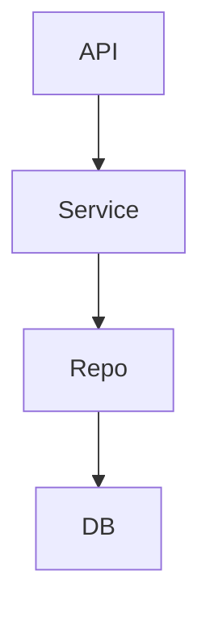

# Architecture Overview

RacerAPI enforces a strict layered architecture to keep concerns separated and to make reasoning, testing, and evolution easier.

Mermaid diagram showing the flow:

Why this structure?
- API: HTTP layer, request/response models, routing and authentication.
- Service: business rules and orchestration, raises domain-level exceptions.
- Repo: persistence implementation, maps business objects to DB rows.
- DB: the physical storage (managed through migrations).

This separation reduces accidental coupling (for example, database code leaking into the API layer) and makes it straightforward to swap persistence backends or add cross-cutting concerns (caching, events) at the correct layer.
